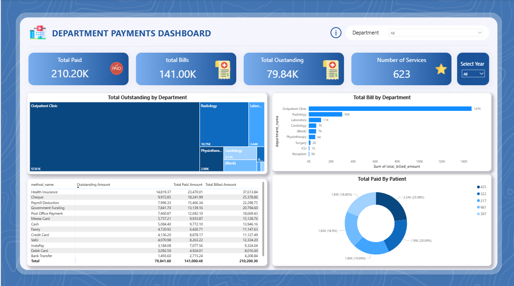

# Hospital BI System


A full-stack Business Intelligence solution for hospital operations, combining a transactional database, an enterprise data warehouse, ETL pipelines (SSIS), analytical dashboards (Power BI), paginated reports (SSRS), and a production-ready web application (ASP.NET Core API + React).

---

## ✨ Key Features

- **Operational Database**: Normalized SQL Server schema for hospital management (patients, visits, billing, radiology, labs, HR, rooms, etc.).
- **Data Warehouse (DWH)**: Star-schema facts & dimensions to enable high‑performance analytics.
- **ETL (SSIS)**: Robust packages to extract, transform, and load from OLTP to DWH.
- **Dashboards (Power BI)**: Interactive analytics for Billing, Clinical, Expenses, Visits, and Workload.
- **Reports (SSRS)**: Pixel-perfect operational & compliance reports.
- **Web App**:
  - **Backend**: ASP.NET Core (.NET 9) REST API with JWT auth, AutoMapper, EF Core, SQL Server
  - **Frontend**: React-based dashboard & login flows

---

## 📁 Repository Structure

```
Hospital_BI System/
├─ dashboards/               # Power BI pbix + screenshots
├─ data-warehouse/           # DWH creation scripts & mapping
├─ database-scripts/         # OLTP DB creation, SPs, ERD & mapping
├─ docs/                     # Project documentation & slide deck
├─ etl-ssis/                 # SSIS solutions & package screenshots
├─ reports-ssrs/             # SSRS project, datasets & sample outputs
└─ web-app/                  # ASP.NET Core API + React frontend
```

**Highlights by folder**

- `database-scripts/`
  - Create DB: `database_creation_code/DB_creation.sql`
  - Stored Procedures: `stored_procedure_code/*.sql`
  - ERD: `erd/erd.png`
  - Mapping: `table_mapping/mapping.pdf`

- `data-warehouse/`
  - Create DWH: `DWH_creation/DWH_CREATION.sql`
  - Star Schema Mapping: `table_mapping/DWH_MAPPING.pdf`, `DWH.png`

- `etl-ssis/`
  - Multiple SSIS solutions (dim/fact loads): `Hospital_ETL(1..3)/`
  - Connection managers: `_sqlexpress.*.conmgr`
  - Package examples: `Fact Clinical.dtsx`, `Fact Expenses.dtsx`, `Dim Doctor.dtsx`, etc.

- `dashboards/`
  - PBIX sources: `source-files/*.pbix`
  - Screenshots: `screenshots/fact_*/`

- `reports-ssrs/`
  - Solution: `report-project/Report FinalProject.sln`
  - Reports: `Report FinalProject/*.rdl` (e.g., `All_Bill_Summary.rdl`)

- `web-app/`
  - **API** (`HospitalSystemAPI/`): .NET 9, EF Core, JWT auth
  - **Frontend** (`hospital-frontend/`): React app with login & dashboards

---

## 🧱 Architecture Overview

```
[OLTP SQL Server] --(SSIS ETL)--> [Data Warehouse / Star Schema]
       |                                   |
       |                                   +--> [Power BI Dashboards]
       |                                   +--> [SSRS Reports]
       +--(EF Core / REST)--> [ASP.NET Core API] <--(HTTP/JSON)--> [React Frontend]
```

- **ERD (OLTP)**: [`database-scripts/erd/erd.png`](./database-scripts/erd/erd.png)
- **DWH Mapping**: [`data-warehouse/table_mapping/DWH.png`](./data-warehouse/table_mapping/DWH.png)

---

## 🛠️ Tech Stack

- **Database**: Microsoft SQL Server
- **ETL**: SQL Server Integration Services (SSIS)
- **DWH**: Star schema (Facts: Billing, Clinical, Expenses, Visit, Workload; Dimensions: Patient, Doctor, Service, Room, Bed, Insurance, etc.)
- **Analytics**: Power BI (PBIX), SSRS
- **Backend**: ASP.NET Core (.NET 9), EF Core, AutoMapper, JWT
- **Frontend**: React (Create React App), HTML/CSS/JS

---

## 🚀 Getting Started

### 1) Prerequisites

- **Windows** with SQL Server & SQL Server Management Studio (SSMS)
- **SQL Server Integration Services (SSIS)** + Visual Studio with SSIS/SSDT extensions
- **SQL Server Reporting Services (SSRS)** (or report server) & Report Builder (optional)
- **Power BI Desktop** (for `.pbix`)
- **.NET 9 SDK**
- **Node.js 18+** and **npm**

> Recommended VS extensions:
> - *Integration Services Projects* (SSIS)
> - *Analysis Services / Reporting Services Projects* (for SSRS)

### 2) Clone the Repository

```bash
git clone https://github.com/<your-username>/Hospital_BI-System.git
cd Hospital_BI-System
```

### 3) Provision the OLTP Database

1. Open **SSMS** and connect to your SQL Server instance.
2. Run `database-scripts/database_creation_code/DB_creation.sql` to create schema & seed sample data (if included).
3. (Optional) Execute stored procedures found in `database-scripts/stored_procedure_code/` as needed.

### 4) Provision the Data Warehouse

1. In **SSMS**, run `data-warehouse/DWH_creation/DWH_CREATION.sql` to create DWH objects.
2. Review star-schema mapping in `data-warehouse/table_mapping/DWH_MAPPING.pdf`.

### 5) Configure & Run ETL (SSIS)

1. Open the solution under `etl-ssis/Hospital_ETL(2)/Integration Services Project1.sln` (or `Hospital_ETL.sln` depending on your setup).
2. Update **connection managers** to point at your SQL Server instances (OLTP & DWH):
   - `_sqlexpress.HOSPITAL.conmgr` (source)
   - `_sqlexpress.DWH.conmgr` (destination)
3. Execute the **Dimension** packages first (e.g., `Dim Doctor.dtsx`, `Dim Service.dtsx`, etc.).
4. Execute the **Fact** packages (e.g., `Fact Clinical.dtsx`, `Fact Expenses.dtsx`, `Fact Billing.dtsx`, `Fact visit.dtsx`, `Fact Employees_Workload.dtsx`).

### 6) Run the Backend API (.NET 9)

```bash
cd web-app/HospitalSystemAPI
# Create or edit appsettings.json with your SQL Server connection strings
# Example (replace with your server/DB names):
# {
#   "ConnectionStrings": {
#     "DefaultConnection": "Server=localhost;Database=HOSPITAL;Trusted_Connection=True;TrustServerCertificate=True;",
#     "DwhConnection": "Server=localhost;Database=DWH;Trusted_Connection=True;TrustServerCertificate=True;"
#   },
#   "Jwt": { "Key": "<dev-secret>", "Issuer": "Hospital.API", "Audience": "Hospital.Client" }
# }

# Restore & run
dotnet restore
dotnet run
```

The API will expose Swagger UI by default (via Swashbuckle) when running locally.

### 7) Run the Frontend (React)

```bash
cd web-app/hospital-frontend
npm install
npm start
```

The app will start on `http://localhost:3000/` by default.

### 8) Open Dashboards (Power BI)

- Open any PBIX under `dashboards/source-files/` (e.g., `fact_billing.pbix`, `fact_expenses.pbix`).
- Sample screenshots are available under `dashboards/screenshots/` for quick preview.

### 9) Deploy/Preview SSRS Reports

1. Open `reports-ssrs/report-project/Report FinalProject.sln` in Visual Studio (with Reporting Services extensions).
2. Configure the shared data source `vortDS.rds` to your SQL Server.
3. Preview or deploy the `.rdl` reports to your SSRS server.

---

## 🔐 Authentication & Authorization (API)

- **JWT Bearer** authentication.
- **Role/Permission-based** authorization via custom `PermissionRequirement` and `PermissionHandler` (see `web-app/HospitalSystemAPI/Authorization/`).
- Login endpoint issues a token; secured endpoints require `Authorization: Bearer <token>` header.

**Key Files**
- `Authorization/PermissionRequirement.cs`
- `Authorization/PermissionHandler.cs`
- `Services/JwtTokenService.cs`
- `Controller/LoginController.cs`

---

## 📚 API Surface (Selected Endpoints)

> Base URL: `https://localhost:<port>/api/`

- **Auth**
  - `POST /api/login` – obtain JWT
  - `GET /api/secure` – test secured route

- **Patients**
  - `GET /api/patient`
  - `GET /api/patient/{id}`
  - `POST /api/patient`
  - `PUT /api/patient/{id}`

- **Vitals**
  - `GET /api/vital`
  - `POST /api/vital`

- **Billing**
  - `GET /api/billing/summary`

- **Clinical** / **Radiology** / **Lab Results**
  - `GET /api/medicalrecord`
  - `GET /api/radiologyreport`
  - `GET /api/labresult`

> See controllers in `web-app/HospitalSystemAPI/Controller/*.cs` and DTOs in `web-app/HospitalSystemAPI/DTO/*.cs`.

---

## 🖼️ Screenshots

- **ERD (OLTP)**: 
- **DWH Mapping**: 
- **Power BI (Billing)**: 
- **Power BI (Clinical)**: 
- **SSIS Packages**: 
- **SSRS Sample**: 

---

## 🧪 Data Flow & Modeling Notes

- Conformed dimensions across facts (Patient, Doctor, Service, Time, Room, Bed, Insurance, etc.)
- Slowly Changing Dimensions (where applicable) can be handled in SSIS or T-SQL (not shown by default).
- Surrogate keys in dimensions; integer foreign keys in fact tables.
- ETL order: **dimensions first**, then **facts**.

---

## 🧰 Troubleshooting

- **SSIS package connection errors**: Open each `.dtsx`, update connection managers to your server names, and test connection.
- **TrustServerCertificate**: For local dev with self-signed certs, set `TrustServerCertificate=True` in connection strings.
- **EF Core migrations**: This project uses scripts for DB creation; if you add models, generate migrations and update DBs accordingly.
- **Swagger not loading**: Ensure `ASPNETCORE_ENVIRONMENT=Development` and `dotnet run` on the API.
- **Power BI refresh**: Update data source credentials/paths to point to your SQL Server and DWH.

---

## 📦 Roadmap

- Add CI/CD for SSIS & API
- Containerize API + SQL Server for local dev
- Add role-based UI in React (permissions-aware menus)
- Incremental refresh in Power BI
- Add unit/integration tests

---

## 🤝 Contributing

1. Fork the repo
2. Create a feature branch: `git checkout -b feat/awesome`
3. Commit changes: `git commit -m "feat: add awesome thing"`
4. Push: `git push origin feat/awesome`
5. Open a Pull Request

---

## 🪪 License

This project is licensed under the MIT License — see `LICENSE` (add one if missing).

---

## 📫 Contact

**Ahmed Salem**  
AI & Data Science Engineer  
Email: ahmmed.salem.ai@gmail.com  
LinkedIn: https://www.linkedin.com/in/ahmed-salem-ai  
GitHub: https://github.com/salemnka7

---

> _Tip: Replace placeholder connection strings, add .env-style secrets management for production, and consider adding a `docker-compose.yml` for one‑click local setup._

